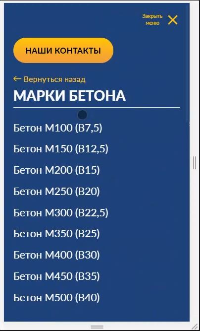

**[Demo](http://84.38.180.229:116)**

## Используемые технологии

- JavaScript

- CSS

## Задача

Необходимо создать на сайте мобильное меню, работающее следующим образом:



На сервере существует адрес (к примеру, `/api/getMenu`), при обращении на который отдаётся структура мобильного меню в формате JSON следующего вида:

```JSON
[
  {
    "title": "Заголовок пункта меню",
    "url": "https://test.site/item1"
  },
  {
    "title": "Заголовок пункта меню1",
    "url": "https://test.site/item2",
    "children": [
      {
        "title": "Заголовок пункта меню2",
        "url": "https://test.site/item3"
      },
      {
        "title": "Заголовок пункта меню3",
        "url": "https://test.site/item3",
        "children": [
          {
            "title": "Заголовок пункта меню4",
            "url": "https://test.site/item4"
          },
          {
            "title": "Заголовок пункта меню6",
            "url": "https://test.site/item6"
          }
        ]
      }
    ]
  },
  {
    "title": "Заголовок пункта меню5",
    "url": "https://test.site/item5"
  }
]
```

Каждый пункт меню может содержать дочерние ресурсы, вложенность неограниченна. Наличие или отсутствие детей определяется полем `children` в каждом объекте.

Необходимо сверстать меню и написать файл `menu.js`, который при загрузке страницы запрашивает мобильное меню с сервера и строит его.

Пункты меню кликабельны (это ссылки), но те, у которых есть дети, должны также раскрываться по какому-нибудь принципу (в примере выше - стрелки рядом с пункатами).

Внешний вид может быть любым, но обязательно наличие хотя бы какой-нибудь анимации при переходе между экранами.
